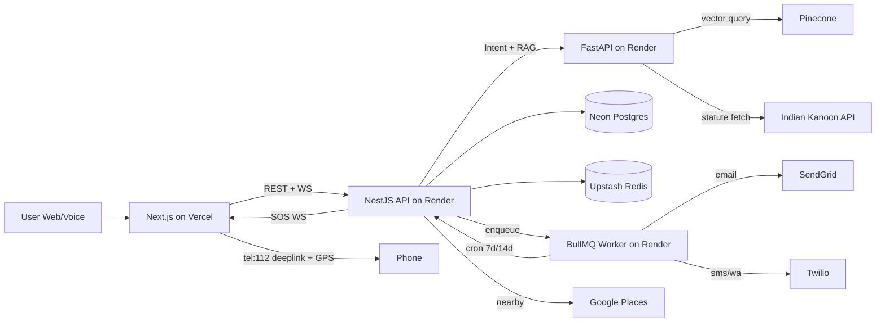
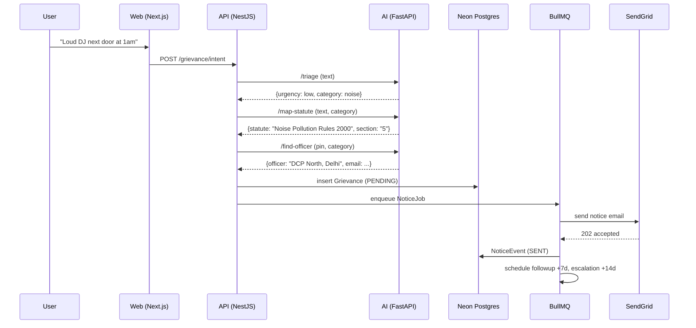

# Actionable Justice OS — Execution Plan

> Team Maverick (Kamakshi & Chirag) · 7-day hackathon-grade build · Free-tier deployment
>
> Source documents: [`../Layers.md`](../Layers.md), [`../PROJECT_BLUEPRINT.md`](../PROJECT_BLUEPRINT.md)
> Companion: [`CURSOR_PROMPTS.md`](CURSOR_PROMPTS.md) — the 10 dense prompts to paste into Cursor / Antigravity in order.

**Local first, deploy later (fine for hackathons with a public org repo):** It is **correct and common** to spend the first day or so getting everything running only on your machine: `docker compose` for Postgres and Redis, local `pnpm dev` and FastAPI, and `.env` in `.gitignore` — with **no** push to the hackathon team’s public Git remote until you are ready. You do not need a separate personal GitHub repo: when you *do* push, use the repo they gave you, or a **private** fork/branch if the org allows. Treat **Vercel + Render + Neon** as **Phase 2** after a vertical slice works locally. See §2.1 and Prompt 1 in `CURSOR_PROMPTS.md` for the split.

---

## 1. Vision recap

Actionable Justice OS is an **Execution-First** legal redressal infrastructure that automates the full lifecycle of an Indian citizen's grievance — from immediate life-safety (SOS) to RAG-grounded legal mapping, automated notice filing, and an autonomous follow-up loop that "never lets go".

Four layers, one product:

| Layer | Name | Purpose | Headline feature |
|------:|------|---------|------------------|
| 0 | Urgency | Life-safety triage | **Pulse SOS** |
| 1 | Intelligence | NL → Statute → Authority | **Statute Guard** |
| 2 | Execution | Filing without manual effort | **Direct-File** |
| 3 | Persistence | Accountability loop | **Persistence Bot** |

---

## 2. Tech & deployment matrix (free-tier, hackathon-grade)

| Concern | Choice | Where it runs | Free-tier limit | Why |
|---|---|---|---|---|
| Web frontend | Next.js 14 (App Router) + TS + Tailwind + Framer Motion | **Vercel** | Generous, sleeps never | Best-in-class DX, native Next support |
| Orchestrator API | NestJS + Socket.io + BullMQ producer | **Render** Web Service | 750 hrs/mo, sleeps after 15 min | Modular structure suits 4 layers |
| Background worker | NestJS standalone + BullMQ consumer + node-cron | **Render** Background Worker | Same | Keeps cron + queue logic isolated |
| AI / RAG service | FastAPI + LangChain | **Render** Web Service (Python) | Same | Python-native LangChain ecosystem |
| Relational DB | Postgres (Prisma ORM) | **Neon** | 0.5 GB, branching, never sleeps | Serverless Postgres with branching for demos |
| Cache + queue | Redis | **Upstash** | 10k commands/day | HTTP-based, free, Render-friendly |
| Vector DB | Pinecone | **Pinecone** Starter | 1 index, 100k vectors | Plenty for IPC/BNS + officer corpus |
| Auth | Clerk | **Clerk** | 10k MAU free | Skip building auth |
| Email | SendGrid | API | 100 emails/day | Enough for demo + a few real follow-ups |
| SMS / WhatsApp | Twilio (trial) | API | Trial credits | Verified numbers only — fine for demo |
| Voice (multilingual) | Bhashini WebSocket | API | Free public API | 22 Indian languages |
| Legal corpus | Indian Kanoon API | API | Tiered | Grounds RAG with verified statutes |
| Geo (police/hospital) | Google Places (Nearby Search) | API | $200/mo free credit | Layer 0 |
| Officer dataset | CPGRAMS Nodal Officer dataset (Data.gov.in CSV) | One-time ingest | Free | 1.07L+ grievance officers |
| Monorepo / pkg mgr | pnpm workspaces | — | — | Single repo for Cursor context |
| CI | GitHub Actions | — | 2k min/mo free | Lint, typecheck, test on PR |

**Cold-start mitigation** (applies only after you deploy): a public Vercel cron pings each Render service every 10 minutes during the demo window so judges never see a 50-second wake-up.

### 2.1 Local vs cloud, in order

| Phase | When | What you do |
|------|------|-------------|
| **A — Local** | Day 0–1 (or until you are comfortable) | Monorepo, Docker Postgres + Redis, all apps on `localhost`, API keys in `.env` (never committed). No requirement to connect Vercel, Render, or public CI yet. Prisma: use `DATABASE_URL` pointed at `localhost` from [`../infra/docker-compose.yml`](../infra/docker-compose.yml). |
| **B — First push** | When the basic product is there | Commit to a branch, push to the **hackathon-provided** remote (or private branch if available). You can still **skip** deploy for another day. |
| **C — Cloud** | When you need a public URL (judges, teammates) | Neon, Upstash, Vercel, Render, env vars in dashboards — follow Day 0 / Prompt 1 “deployment impact” and the Day 6 checklist. |

Nothing in the product architecture **requires** cloud on day one; the plan lists cloud targets so you know the end state, not a Day 0 obligation.

---

## 3. Repository layout

```text
actionable-justice-os/
├── apps/
│   ├── web/                 # Next.js 14 (App Router)
│   ├── api/                 # NestJS REST + Socket.io + BullMQ producer
│   ├── worker/              # NestJS standalone (BullMQ consumer + node-cron)
│   └── ai/                  # FastAPI + LangChain (RAG)
├── packages/
│   ├── shared/              # TS types, zod schemas, notice templates
│   └── prisma/              # Prisma schema + migrations + seed
├── infra/
│   ├── docker-compose.yml   # local Postgres + Redis
│   └── render.yaml          # IaC for Render (api, worker, ai)
├── docs/
│   ├── EXECUTION_PLAN.md    # this file
│   └── CURSOR_PROMPTS.md    # the 10 ready-to-paste prompts
├── .github/workflows/ci.yml
├── package.json             # root pnpm workspace
└── pnpm-workspace.yaml
```

---

## 4. Architecture & data flow



### End-to-end happy path (a noise complaint)



---

## 5. Database schema (Prisma sketch)

```prisma
model User {
  id            String    @id @default(cuid())
  clerkId       String    @unique
  fullName      String
  primaryPin    String?
  contacts      EmergencyContact[]
  grievances    Grievance[]
  createdAt     DateTime  @default(now())
}

model EmergencyContact {
  id        String  @id @default(cuid())
  userId    String
  name      String
  phone     String
  relation  String?
  user      User    @relation(fields: [userId], references: [id])
}

model Officer {
  id            String  @id @default(cuid())
  name          String
  designation   String
  department    String
  jurisdictionPin String
  email         String
  parentId      String?     // for escalation hierarchy
  parent        Officer?    @relation("Hierarchy", fields: [parentId], references: [id])
  children      Officer[]   @relation("Hierarchy")
}

model Grievance {
  id          String   @id @default(cuid())
  userId      String
  rawText     String
  language    String
  category    String           // noise, harassment, electricity, ...
  urgency     Urgency          // critical | high | normal
  statute     String
  section     String
  officerId   String
  status      GrievanceStatus  // PENDING | FILED | FOLLOWED_UP | ESCALATED | RESOLVED
  pin         String
  lat         Float?
  lng         Float?
  filedAt     DateTime?
  resolvedAt  DateTime?
  events      NoticeEvent[]
  user        User     @relation(fields: [userId], references: [id])
  officer     Officer  @relation(fields: [officerId], references: [id])
  createdAt   DateTime @default(now())
}

model NoticeEvent {
  id          String   @id @default(cuid())
  grievanceId String
  kind        EventKind        // FILED | FOLLOWUP_7D | ESCALATION_14D | SOS_BROADCAST
  channel     Channel          // EMAIL | SMS | WHATSAPP | SYSTEM
  payload     Json
  sentAt      DateTime @default(now())
  grievance   Grievance @relation(fields: [grievanceId], references: [id])
}

enum Urgency { CRITICAL HIGH NORMAL }
enum GrievanceStatus { PENDING FILED FOLLOWED_UP ESCALATED RESOLVED }
enum EventKind { FILED FOLLOWUP_7D ESCALATION_14D SOS_BROADCAST }
enum Channel { EMAIL SMS WHATSAPP SYSTEM }
```

---

## 6. Public API surface (apps/api)

| Method | Path | Purpose |
|---|---|---|
| `POST` | `/grievance/intent` | Run triage + statute + officer mapping |
| `POST` | `/grievance` | Create grievance + enqueue NoticeJob |
| `GET`  | `/grievance/:id` | Fetch grievance + Chain-of-Action timeline |
| `GET`  | `/grievance` | List user's grievances |
| `POST` | `/sos/trigger` | Broadcast SOS (Twilio + Places) |
| `POST` | `/sos/contacts` | Manage emergency contacts |
| `WS`   | `/sos` (Socket.io ns) | Real-time SOS stream |
| `WS`   | `/voice` (Socket.io ns) | Bhashini relay |
| `GET`  | `/healthz` | Liveness probe (used by cold-start pinger) |

AI service (apps/ai) — FastAPI:

| Method | Path | Purpose |
|---|---|---|
| `POST` | `/triage` | `{text}` → `{urgency, category, confidence}` |
| `POST` | `/map-statute` | `{text, category}` → `{statute, section, citations[]}` |
| `POST` | `/find-officer` | `{pin, category}` → `{officer, parent}` (vector + SQL hybrid) |
| `GET`  | `/healthz` | Liveness probe |

---

## 7. Seven-day execution schedule

> Each day ends with a deployable artefact. Never let "deployment" be a Day 6 surprise.

### Day 0 — Foundations (≈3 hrs)

- [ ] **Minimum today (local)**: pnpm monorepo, `docker compose up` for Postgres + Redis, all four apps’ `/healthz` on localhost, `.env.example` with no secrets. *Skip* Vercel, Render, and public Neon until Phase C if you want code to stay off the public remote for now.
- [ ] **Can wait until you push or need a live URL**: full accounts: Vercel, Render, Neon, Upstash, — or create these when you start Phase C.
- [ ] Create API accounts you need for **local** feature work: Pinecone, Clerk, SendGrid, Twilio (trial), Google Cloud, Bhashini, Indian Kanoon
- [ ] Single-sender verification on SendGrid (most-skipped step that breaks demos)
- [ ] Twilio: provision trial number, verify your & teammate's numbers
- [ ] Google Cloud: enable Places API, restrict key by server IP / localhost as appropriate for your phase
- [ ] Use the **hackathon team’s** Git remote (or private branch) when you push; no need to create a separate repo
- [ ] **Run Cursor Prompt 1** → monorepo bootstrap, lint/format, optional CI, **local** “hello world” (docker + all `/healthz` on localhost)
- [ ] **Verify (local)**: all four services respond on `localhost` with 200; Postgres + Redis from `docker compose` only
- [ ] **When you are ready to deploy (Phase C)**: connect Vercel + Render, verify 4 public URLs, add cron pinger (see `CURSOR_PROMPTS.md` Prompt 1 and Prompt 10)

### Day 1 — Layer 1: Intelligence (≈8 hrs)

- [ ] **Run Cursor Prompt 2** → Prisma schema, migrations, seed (use local `DATABASE_URL` from Docker, or Neon when you switch to cloud)
- [ ] **Run Cursor Prompt 3** → FastAPI AI service: `/triage`, `/map-statute`, `/find-officer`
- [ ] **Run Cursor Prompt 4** → ingestion job for IPC/BNS sections + Noise (2000) + Electricity (2020) rules + CPGRAMS officer CSV → Postgres + Pinecone
- [ ] Hard-code 3 demo personas in seed: harassment (urgent), noise (medium), electricity (normal) — this guarantees a working demo even if RAG flakes
- [ ] Verify: `curl /map-statute` returns the right IPC section for each persona

### Day 2 — Layer 2: Execution (≈8 hrs)

- [ ] **Run Cursor Prompt 5** → NestJS `auth` (Clerk), `grievance`, `notice`, `filing` modules
- [ ] Notice template: structured JSON → Handlebars HTML → optional PDF (puppeteer-core + @sparticuz/chromium on Render? **Skip PDF on free tier** — HTML email is fine for demo)
- [ ] SendGrid integration with retry + idempotency key per NoticeEvent
- [ ] Verify: file a grievance for the noise persona → DCP North receives a real email at your Gmail (use your own email as the officer email in dev seed)

### Day 3 — Layer 3: Persistence (≈8 hrs)

- [ ] **Run Cursor Prompt 6** → BullMQ worker app
- [ ] Queues: `grievance-followup` (delay 7d), `escalation` (delay 14d), `sos-broadcast` (immediate)
- [ ] node-cron daily tick at 09:00 IST that reconciles state (catches missed jobs after Render sleep)
- [ ] Add `/grievance/:id/timeline` endpoint returning Chain-of-Action events
- [ ] Demo trick: a `?demoSpeed=fast` query param compresses 7d/14d to 30s/60s for live demos
- [ ] Verify: file grievance with `demoSpeed=fast` → followup email + escalation email arrive within 90 seconds

### Day 4 — Layer 0: SOS + real-time (≈8 hrs)

- [ ] **Run Cursor Prompt 7** → SOS module
- [ ] Socket.io `sos` namespace: client opens connection, server pushes broadcast acks
- [ ] `POST /sos/trigger` flow: persist event → Google Places nearest-3 (police, hospital) → Twilio WA + SMS broadcast → emit WS event → return tel:112 deep-link
- [ ] AI integration: when triage returns `urgency=critical`, web auto-opens red interface with pre-filled message
- [ ] Verify: hitting trigger sends real WhatsApp + SMS to your verified Twilio numbers in <5 s

### Day 5 — Frontend + voice (≈10 hrs)

- [ ] **Run Cursor Prompt 8** → Next.js pages: `/`, `/dashboard`, `/sos`, `/onboard`
- [ ] Clerk auth, Tailwind design system, Framer Motion (SOS pulse, timeline reveal)
- [ ] **Run Cursor Prompt 9** → Bhashini WebSocket voice intake on `/`
- [ ] Language selector (22 langs), interim transcript display, intent-driven SOS expansion
- [ ] Polish: loading skeletons, empty states, error boundaries

### Day 6 — Deploy + demo polish (≈8 hrs)

- [ ] **Run Cursor Prompt 10** → render.yaml, Vercel envs, demo seed, cold-start pinger, README, judge one-pager
- [ ] Custom subdomain via Vercel (e.g. `justice-os.vercel.app`)
- [ ] Seed 3 demo grievances at different lifecycle stages so the dashboard isn't empty
- [ ] Record 90-second screencap walking through: SOS → chat → notice fired → 7d follow-up → 14d escalation
- [ ] Write `JUDGES.md` one-pager: problem, layers, live URL, 3 things to click, tech depth
- [ ] Final dress rehearsal: full flow from cold start to escalation in under 4 minutes

---

## 8. Risk register & mitigations

| Risk | Likelihood | Impact | Mitigation |
|---|---|---|---|
| Render free tier cold-starts (50 s wake) | High | Demo killer | Vercel cron pings `/healthz` every 10 min during demo window |
| Bhashini auth/latency | Medium | Voice doesn't work live | Typed-text fallback always available; voice is "wow", not blocker |
| No public "Trigger SOS" API | Certain | None | Spec already accepts `tel:112` deep-link + Twilio broadcast |
| AI hallucination | Medium | Trust collapse | RAG-only; below-threshold confidence → "needs lawyer review" copy |
| SendGrid blocks unverified sender | High if forgotten | All emails fail | Verify single-sender on Day 0, not Day 6 |
| Twilio trial only sends to verified numbers | Certain | Demo limited to your phones | Use verified numbers in demo; document the limit on judge one-pager |
| Pinecone region drift | Low | RAG slow | Pin to `gcp-starter` and AI service to nearest Render region |
| Google Places key leak in client | Medium | Quota burn | Calls go through NestJS only; key never in browser |
| pnpm + Render deploy quirks | Medium | Deploy fails | Use `corepack enable` + explicit `pnpm@9` in `render.yaml` |
| Demo data polluting prod DB | Low | Embarrassing | Use Neon branches: `main` for prod, `demo` for hackathon screencast |

---

## 9. Demo script (4 minutes, judge-facing)

1. **0:00–0:30** Open `/sos` page on phone. Tap red button. Show real WhatsApp + SMS landing on judge's phone with GPS link. Tap `tel:112` deep-link to prove it dials.
2. **0:30–1:30** Switch to `/`. Type / speak in Hindi: *"Mere ghar ke pass bahut shor hai raat ko"*. Show triage card identifying noise + Rule 5 Noise Pollution Rules 2000 + DCP North email.
3. **1:30–2:30** Hit File. Show Chain-of-Action timeline: filed → 7-day follow-up → 14-day escalation, with `?demoSpeed=fast` so judges see all three events in 90 s. Show the actual emails arriving.
4. **2:30–3:30** Open `/dashboard`. Walk through 3 seeded grievances at different stages. Highlight the persistence loop diagram.
5. **3:30–4:00** Close on the architecture slide and the live URL.

---

## 10. Definition of "Done" for the hackathon

- [ ] All 4 layers demonstrably work end-to-end against a live URL
- [ ] At least one real Indian language voice intake works (Hindi minimum)
- [ ] One real grievance can be filed → followed up → escalated within the demo window
- [ ] SOS broadcasts a real WhatsApp + SMS to a verified phone in <5 s
- [ ] Dashboard shows the full Chain of Action visually
- [ ] README + JUDGES.md committed
- [ ] No secrets in git; all envs in Vercel/Render dashboards

---

## 11. After the hackathon (parking lot)

- DigiLocker integration for verified citizen identity
- Real CPGRAMS portal filing once API access is granted (currently scraped/CSV)
- Lawyer marketplace for the "needs lawyer review" branch
- Civic analytics: heatmap of grievances by PIN + category
- Native mobile (Expo) so SOS works without a browser
